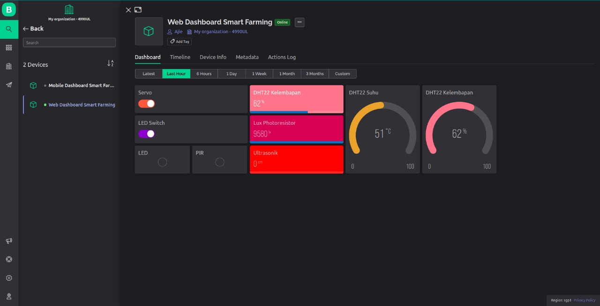

# Dashboard Monitoring DHT22

## Screenshots

## Environment Variables Blynk.io

To run this project, you will need to add the following environment variables to your .env file

`BYLNK_TEMPLATE_ID`

`BLYNK_AUTH_TOKEN`

