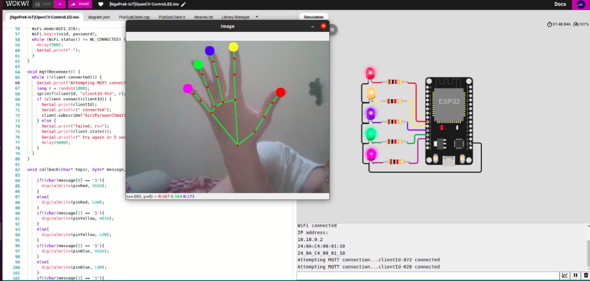

# fingersUp-OpenCV

First upload code standard firmata Arduino (Serial)
Open IDE Arduino -> File -> Examples -> Firmata -> StandardFirmata

Wokwi Project = https://wokwi.com/projects/344958570893148755

# OpenCV finger control led

## Screenshots

## Environment Variables Blynk.io

To run this project, you will need to add the following environment variables to your .env file

`MQTT`

